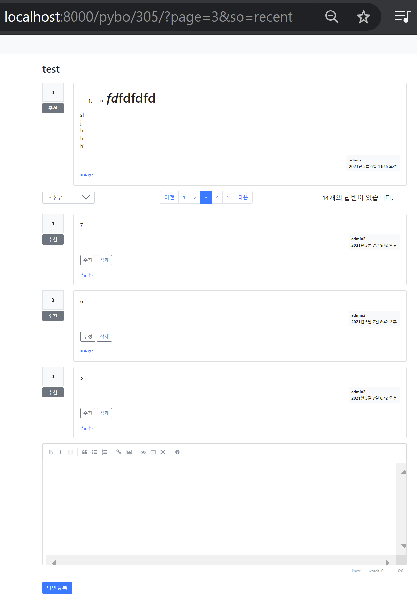

# 309-316 게시판 기능 업그레이드
> - 지금까지 Q&A목록/내용을 표시/등록하고 로그인/로그아웃 및 회원가입기능등 핵심기능을 구현했고 마지막으로 모델에 필드가 추가될 경우(글쓴이) 어떻게 바뀔 수 있는지 살펴보았다. 
> - 이 과정에서 *입력템플릿 -> url매핑 -> views함수 -> 출력템플릿* 과 같은 정형화된 개발과정을 경험했고, bootstrap, 표준HTML 등에도 어느정도 익숙해졌다.
> - 앞으로 수정/삭제, 댓글, 추천, 검색, 정렬 등 게시판답게하는 기능들을 추가해 갈텐데, 이렇게 제품이 커지는 만큼 유지/관리의 효용성을 고려해 파일구조를 개편하게 된다.

## 3-09 게시물 수정&삭제 기능 추가
1. 모델 고치기
   
   [1] [파일명: C:\projects\mysite\pybo\models.py]
   
    ```python
             class Question(models.Model):
                (... 생략 ...)
            # ---------------------------------- [edit] ------------------ #
                modify_date = models.DateTimeField(null=True, blank=True)
            # ------------------------------------------------------------#
    ```
    - `null=True` DB에서 modify_date칼럼에 null을 허용함.
    - `blank=True` 값이 없어도 `form.is_valid()`를 통한 입력폼 데이터 검사 통과.  
  
   [2] makemigration, migrate


2. 질문 수정/삭제 기능 추가
   [1] 수정 버튼[파일명: C:\projects\mysite\templates\pybo\question_detail.html]
   ```html
   
        <div class="my-3">
            <a href="" 
               class="btn btn-sm btn-outline-secondary">수정</a>
        </div>
        
   ```
   [2] 수정 버튼 URL 매핑 [파일명: C:\projects\mysite\pybo\urls.py]
   ```python
   path('question/modify/<int:question_id>/',
         views.question_modify, name='question_modify'),
   ```
   [3] 수정 함수 추가 [파일명: C:\projects\mysite\pybo\views.py]
   ```python
    from django.contrib import messages
    (... 생략 ...)
    @login_required(login_url='common:login')
    def question_modify(request, question_id):
    
        question = get_object_or_404(Question, pk=question_id)
        if request.user != question.author:
            messages.error(request, '수정권한이 없습니다')
            return redirect('pybo:detail', question_id=question.id)
   
        if request.method == "POST":
            form = QuestionForm(request.POST, instance=question) # 덮어쓰기
            if form.is_valid():
                question = form.save(commit=False)
                question.author = request.user
                question.modify_date = timezone.now()  # 수정일시 저장
                question.save()
                return redirect('pybo:detail', question_id=question.id)
        else:
            form = QuestionForm(instance=question) # 기존값 반영
        context = {'form': form}
        return render(request, 'pybo/question_form.html', context)
   ```
    - &#10071; `수정` GET 방식으로 /pybo/question/modify/2 페이지 호출
    - &#10071; `저장하기` POST 방식으로 /pybo/question/modify/2 호출되어 데이터 수정.
        
        > &#10071; `<저장하기>`할 때 form 엘리먼트에 action속성이 없으면 현재페이지로 폼을 전송  
    - 참고: [파일명: C:\projects\mysite\templates\pybo\question_form.html]
    ```html
        <form method="post" class="post-form my-3"> <!-- action속성이 없다 -->
        
        (... 생략 ...)        
        <div class="form-group">
            <label for="subject">제목</label>
            <input type="text" class="form-control" name="subject" id="subject"
                value="{{ form.subject.value|default_if_none:'' }}">
        </div>
        <div class="form-group">
            <label for="content">내용</label>
            <textarea class="form-control" name="content" id="content"
                rows="10">{{ form.content.value|default_if_none:'' }}</textarea>
        </div>
        <!-- 버튼도 링크 안되어 있다. 그럼에도 불구하고
         버튼을 누르면 현재페이지로 폼을 전송한다.-->
        <button type="submit" class="btn btn-primary">저장하기</button>
        </form>
    ```
    [4] 질문 삭제 기능 추가 [파일명: C:\projects\mysite\templates\pybo\question_detail.html]
    ```html
    <a href="#" class="delete btn btn-sm btn-outline-secondary"
       data-uri="">삭제</a>
    (... 생략 ...)
    
   
    
    <script type='text/javascript'>
    $(document).ready(function(){ 
        $(".delete").on('click', function() {
            if(confirm("정말로 삭제하시겠습니까?")) {
                location.href = $(this).data('uri');
            }
        });
    });
    </script>
    
    ```
    - jQuery 문법: 선택된 element(selector)에 대해 action을 명령한다.
    ```jquery
    $(selector).action()
    ```
    - &#10071; `selector` 유형
      - `.class 이름` 
      - `#ID`
      - `p` 엘리먼트 (여기서는 \<p>\</p>)
      - `this` 현재 엘리먼트
    - `$(document).ready(function())` 은 화면이 로드된 다음 자동으로 호출되는 제이쿼리 함수이다. jQuery는 엘리먼트를 대상으로 하는 명령어이므로 화면로드가 끝난 후 실행해야 안전하다.
    - &#10071; `data-*`(여기서는 `data-uri`) 속성은 데이터(여기서는 `""`)를 보관하고 있다가  jQuery 스크립트에서 `$(this).data('*')` 와 같이 사용하여 데이터값을 얻을 수 있다.
    - `location.href =`에서는 url값이 지정된다. 따라서 예시에서는 앵커`<a>`가 걸려있어 해당url이 request된다.
   
3. 답변 수정/삭제 기능 추가
4. 수정일시 표시

#### Q. 
- 개발 보수 루틴에 익숙해져 있나요?
- form 데이터를 GET/POST 타입으로 주고받을 때 form.html 템플릿과 views.py 함수에서 어떤일이 벌어지는지 이해했나요?
- jQuery 기본적 문법을 사용할 수 있겠지요?
---
## 3-10 댓글 기능 추가
> 장고 기능 개발 패턴 정리
>
> 1. 화면에 버튼 등 기능 추가하기
> 1. urls.py 파일에 기능에 해당하는 URL 매핑 추가하기
> 1. forms.py 파일에 폼 작성하기
> 1. views.py 파일에 URL 매핑에 추가한 함수 작성하기
> 1. 함수에서 사용할 템플릿 작성하기

- 댓글을 등록할 때는 답변 id 번호 `<int:answer_id>`를, 댓글을 수정 또는 삭제할 때는 댓글 id 번호 `<int:comment_id>`를 사용.
- 질문/답변 댓글 기능은 같은 `CommentForm`과 comment_form.html 파일을 사용.

---
## 3-11 `views.py` 분리
1. 안 좋은 방법
   [파일명: C:\projects\mysite\pybo\views\__init__.py]
   ```python
   from .base_views import *
   from .question_views import *
   from .answer_views import *
   from .comment_views import *
   ```
   - 종전처럼 함수를 사용할 수 있으나 urls.py에는 매핑한 함수명만 있으므로 어느 파일에 담긴 함수인지 알 수 없다.
2. 추천하는 방법
    
   - &#10071;경로를 완벽하게 알 수 있게 urls.py파일을  수정하는 방법이 유지보수에 유리하다. 
   - 분류 기준은?
   
---
## 3-12 추천 기능 추가
- ManytoMany다대다 관계에 유념하여 모델을 수정한다.
- &#10071;`related_name=`으로 User모델을 통해 Question데이터에 접근할 경우 기준을 정해준다.
- &#10071;같은 사용자가 하나의 질문을 여러 번 추천해도 추천 수가 증가하지 않는다. ManyToManyField는 중복을 허락하지 않는다.

  [파일명: C:\projects\mysite\pybo\models.py]
  ```python
  author = models.ForeignKey(User, on_delete=models.CASCADE, related_name='author_question')
  voter = models.ManyToManyField(User, related_name='voter_question')
  ```

- vote_views.py에서는 자기추천을 방지하기 위해 추천자와 글쓴이가 동일하면 추천 시 오류를 발생시킨다. 또한`question.voter.add(request.user)`로 추천인을 `voter`필드에 추가한다.
---
## 3-13 스크롤 문제 해결
- "앵커 엘리먼트의 name속성은 유일해야 한다."고 책에 적혀 있지만 html5에서 name은 \<a\>의 속성이 아니다. name을 써도 동작은 하지만, **북마크** 기능을 넣기 위해 id 속성을 이용하는 것이 바람직하다고 생각한다.
- `resolve_url` 함수는 실제 호출되는 URL을 문자열로 반환하는 장고 함수이다.
- &#10071; 따라서 원하는 위치에 비어있는 앵커를 걸고 리다이렉트시키면 해결! 
  ```html
  <a name="comment_{{ comment.id }}"></a>
  ```
  
  
  ```python
  return redirect('{}#comment_{}'.format(
                resolve_url('pybo:detail', question_id=comment.question.id), comment.id))
  ```
---
## 3-14 마크다운 적용
- `pip install markdown`
- 커스텀 필터 등록 `def mark()`
- 적용코드 `{{ |mark }}`
---

## 3-15 검색, 정렬 기능 추가
무시무시한 검색기능 구현 시간이다. '만료된 페이지'오류를 피해 GET방식으로 request한다.

[1] 검색기능 스키마(schema)
1. 검색key를 입력하고 검색버튼을 누른다. 이미 `page=1`이거나 다른 값을 가지고 있는 상태이다. 즉 `kw`값이 생기고 검색 button에 클릭 이벤트가 발생했다. 
2. 질문목록 템플릿(question_list.html)에서 `kw`값과 `page`값을 폼데이터로 포장해서 base_views파일의 `index`함수로 보낸다.  
3. `index`함수에서 `kw`값으로 `question_list`를 filtering해서 나온 객체와 `page`로부터 paginate하여 얻은 form데이터를 질문목록 템플릿으로 보낸다.
4. 질문목록 템플릿에서 받은 폼 데이터 중에서 `kw`값은 그대로 두고 filtering된 `question_list`객체와 `page`값으로 결정된 질문목록을 화면에 출력한다.

&#10071; 2번과 4번 과정에서 다이렉트로 URL을 호출하기 보다는 클릭이벤트 발생을 jQuery코드가 포착하고 해당 url을 추출해 호출명령내리는 방식으로 한다는 점이 이전과는 다르다.  

[2] 검색 기능의 플로우 차트?

[3] 검색우선순위: 제목 - 내용 - 질문 글쓴이 - 답글 글쓴이
[4] 개발순서
1. 입력템플릿: 
   ㄱ. 검색창 및  
   ㄴ. `kw`와 `page`를 동시에 `GET`방식으로 요청할 수 있는 form 엘리먼트를 추가하고
   ㄷ. 기존에 `"page-link"`클래스의 하드코딩된 링크 url을 대신해서 `data-page`로 변수 저장만 하도록 수정하고
   ㄹ. on-click 이벤트가 발생하면 그 url로 kw와 page의 form데이터를 제출하도록 하는 스크립트 명령을 작성한다.

    [파일명: C:\projects\mysite\templates\pybo\question_list.html]
    ```html
        <div class="row justify-content-end my-3">
            <div class="col-4 input-group">
                <input type="text" class="form-control kw" value="{{ kw|default_if_none:'' }}">  <!--kw를 클래스에 추가-->
                <div class="input-group-append">
                    <button class="btn btn-outline-secondary" type="button" id="btn_search">찾기</button>
                </div>
            </div>
        </div>
        (ㄱ... 생략 ...ㄷ)
        <a class="page-link" data-page="{{ question_list.previous_page_number }}" href="#">이전</a>
        (ㄷ... 생략 ...ㄴ)
    <form id="searchForm" method="get" action="">
        <input type="hidden" id="kw" name="kw" value="{{ kw|default_if_none:'' }}">
        <input type="hidden" id="page" name="page" value="{{ page }}">
    </form>
        (ㄴ... 생략 ...ㄹ)
        
    <script type='text/javascript'>
    $(document).ready(function(){
        $(".page-link").on('click', function() {
            $("#page").val($(this).data("page"));
            $("#searchForm").submit();
        });

        $("#btn_search").on('click', function() {
            $("#kw").val($(".kw").val());
            $("#page").val(1);  // 검색버튼을 클릭할 경우 1페이지부터 조회한다.
            $("#searchForm").submit();
        });
    });
    </script>
    

    ```
2. base_views.index
    ```python
    from django.db.models import Q
    
    (... 생략 ...)
    
    def index(request):
        # 입력 파라미터
        page = request.GET.get('page', '1')  # 페이지
        kw = request.GET.get('kw', '')  # 검색어
    
        # 조회
        question_list = Question.objects.order_by('-create_date')
        if kw:
            question_list = question_list.filter(
                Q(subject__icontains=kw) |  # 제목검색
                Q(content__icontains=kw) |  # 내용검색
                Q(author__username__icontains=kw) |  # 질문 글쓴이검색
                Q(answer__author__username__icontains=kw)  # 답변 글쓴이검색
            ).distinct()
        # 페이징처리
        paginator = Paginator(question_list, 10)  # 페이지당 10개씩 보여주기
        page_obj = paginator.get_page(page)
        context = {'question_list': page_obj, 'page': page, 'kw': kw}  # page와 kw가 추가되었다.
        return render(request, 'pybo/question_list.html', context)
    ```

---
[5] 정렬기능: 최신순, 추천순, 인기순: GET방식
- &#10071;`Question.objects.annotate(num_voter=Count('voter'))`에서 사용한 annotate 함수는 Question 모델의 기존 필드인 author, subject, content, create_date, modify_date, voter에 질문의 추천 수에 해당하는 num_voter 필드를 임시로 추가해 주는 함수
- order_by('-num_voter', '-create_date')와 같이 order_by 함수에 두 개 이상의 인자가 전달되는 경우 1번째 항목부터 우선순위를 매긴다
---

## 3-16 저자 추천 추가 기능
어렵다. 생략
- simpleMDE를 애드온 하려면 다음 코드를 base.html에 추가한다.
각각의 템플릿들에서 textarea엘리먼트들이 `id="content"`로 통일되어 명명되었음을 이용한 코드이다.  
```html
 SimpleMDE CDN 
<link rel="stylesheet" href="https://cdn.jsdelivr.net/simplemde/latest/simplemde.min.css">
<script src="https://cdn.jsdelivr.net/simplemde/latest/simplemde.min.js"></script>

 SimpleMDE 자바스크립트 
<script>
var simplemde = new SimpleMDE({ element: document.getElementById("content") });
</script>
```
- 답변 정렬/페이징을 해보자.
  - 답변정렬과 페이징을 할 변수로 질문목록에서 썼던 so, page를 그대로 detail 함수에서 사용했다. kw변수만 제외한 것이다.
  - 우선 이 detail함수가 들어있는 base_views.py에서 답변목록이 출력되는 question_detail.html 템플릿으로 변수들이 제대로 렌더링되어 출력되는지 확인하고 넘어가는게 좋다.
  - 다음으로 어느 위치에 선택박스와 페이징바를 넣을지 염두에 두고 그 엘리먼트들을 질문목록에서 복사해 템플릿 외관을 어느정도 만들었다.
  - 이제 변수이름과 같은 부분을 답변에 맞게 손질하고 서버를 실행해 겉으로 드러나는 오류가 없는지 살펴보았다.
  - 실제로 동작하도록 하기 위해 데이터 폼을 질문목록에서 가져다 손질하고, jQuery스크립트도 가져왔다.
  이렇게 하여 그림처럼 완성하였다.
  - 참고로 [github 저장소](#references)에서 커밋메시지"답변정렬과 페이징"을 클릭하면 변경사항을 확인할 수 있다.
  

## References
---

| 내용  |  링크  |
| :---: | :---: |
|HTML,Bootstrap, css 등 연습|[w3schools]|
|부트스트랩components|[Bootstrap]|
|markdown연습|[Markdown Tutorial]|
|github저장소|[My github repository]


[W3schools]:https://w3schools.com/
[Bootstrap]:https//bootstrapk.com/components/
[Markdown Tutorial]:https://www.markdowntutorial.com/kr/  
[My github repository]:https://github.com/PhyCosmos/Slow_Slow_.git  

이 문서는 Markdown으로 작성되었습니다.